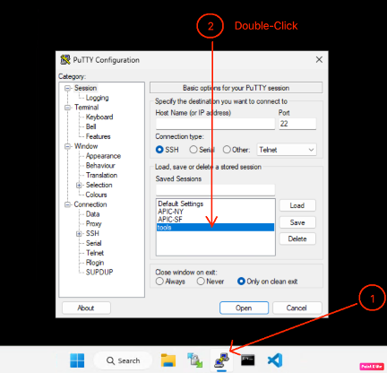

# Getting Started

## Browser Recommendation

!!! warning "Important"
    Please use **Chrome** as your local browser as this is much more likely to work with 'copy and paste' commands.

## Accessing the Lab Environment

### Step 1: Access Your Lab Session

- Click on 'View Session' from your lab dashboard


- You will see the dCloud session details
- Note your assigned IP addresses and credentials

## Topology

The lab environment consists of a dual-fabric ACI deployment with the following components:


### Network Components

**APIC1-A Cluster** - ACI Controller for Fabric A

- URL: `https://apic1-a.corp.pseudoco.com` (198.18.133.200)
- Credentials: `admin` / `C1sco12345`

**APIC1-B Cluster** - ACI Controller for Fabric B  

- URL: `https://apic1-b.corp.pseudoco.com` (198.18.132.200)
- Credentials: `admin` / `C1sco12345`

**Tools VM** - CentOS 7 Linux machine with automation tools

  - Login: `root` / `C1sco12345`
  - Working directories:
    - `/opt/tf` - Terraform custom modules
    - `/opt/nac` - Terraform NAC configuration
    - `/opt/ansible` - Ansible playbooks

### Step 2: Connect to the Workstation

The Workstation provides a graphical desktop environment with all necessary tools pre-installed. 

- To open the remote desktop connection. click the workstation with the RDP label. In this example, it's **'wkst1'**. This is the required access for the ACI GUI, Python and Bruno exercises.


A new browser tab opens that automatically logs you into the session.

### Step 3 Connect to the 'tools' VM 

There are 2 ways this 'tools' VM can be accessed

#### Option 1 - Within the Workstation:

- Click on the Putty icon on the taskbar
- Double-click ON THE 'tools' VM
- Login with credentials: `root` / `C1sco12345`



This method is more useful to observe changes in the APIC GUI when executing the Terraform ‘Apply’, ‘Destroy’ and Ansible commands.

#### Option 2 - Directly from the Topology view:

- Alternatively, you can SSH directly to the **'tools1'** machine. 


This method is better if you prefer a direct session instead of going via the Workstation.

The 'tools' VM is required for all Terraform and Ansible exercises to paste scripts into the VI editor. 

!!! Warning "Script Copy & Paste"
    These Scripts must be fully copied and pasted from the beginning to the end i.e. not in sections as there will otherwise be indentation errors and will not work. Ctrl+C and Ctrl+V may also not work so please instead click on the Right Mouse Button as an alternative.

!!! tip "Terminal Access"
    You can open multiple terminal windows for different tasks. This is helpful when working with both APIC clusters simultaneously.

### Step 4: Access APIC GUI

Open two browser tabs/windows:

1. **APIC1-A**: `https://apic1-a.corp.pseudoco.com`
2. **APIC1-B**: `https://apic1-b.corp.pseudoco.com`

Login to both with credentials: `admin` / `C1sco12345`

!!! note "SSL Certificate Warnings"
    Accept any SSL certificate warnings - this is expected in lab environments.

## Lab Directory Structure

The automation files are organized as follows:

```
/opt/
├── tf/          # Terraform custom module files (Lab 1)
├── nac/         # Terraform NAC configuration (Lab 2)
└── ansible/     # Ansible playbooks (bonus material)
```

## Ready to Begin?

You're now ready to start the labs! Choose your path:

- **[Lab 1: Terraform Custom Module](../lab-guides/lab1-terraform-custom/introduction-to-terraform.md)** - Build Terraform modules from scratch
- **[Lab 2: Terraform NAC](../lab-guides/lab2-terraform-nac/introduction-to-nac.md)** - Use Network as Code approach
- **[Lab 3: Python Automation](../lab-guides/lab3-python/python-overview.md)** - Python SDK automation
- **[Lab 4: Bruno API](../lab-guides/lab4-bruno/bruno-overview.md)** - REST API automation
- **[Lab 5: Ansible Playbooks](../lab-guides/lab5-ansible/ansible-overview.md)** - Build Ansible modules from scratch

!!! tip "Flexible Learning Path"
    While the labs are designed to be completed in sequence, each lab is self-contained. Feel free to jump to the sections that interest you the most!
