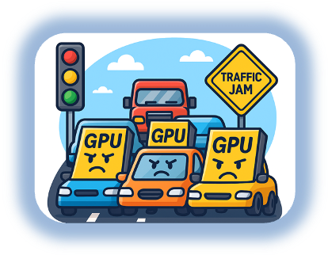

# RoCEv2 Explanation

## What is RoCEv2?

RoCEv2 (RDMA over Converged Ethernet v2) enables servers—especially GPU systems—to exchange data directly over Ethernet with very low latency and high throughput. By bypassing the CPU and kernel network stack, it delivers the predictable performance required for AI training and inferencing.

Unlike RoCEv1, RoCEv2 runs over Layer 3 IP networks, making it routable and scalable across large data center fabrics. This allows RDMA traffic to span multiple racks and pods, which is essential for modern AI deployments.

AI workloads are extremely sensitive to packet loss and congestion. Even small network issues can stall GPU operations and waste expensive compute. RoCEv2 uses lossless Ethernet techniques such as PFC and ECN to prevent drops and control congestion before performance is impacted.

RoCEv2 delivers near–InfiniBand performance using standard Ethernet. This avoids the cost, complexity, and operational overhead of separate InfiniBand networks, making RoCEv2 the preferred choice for enterprise and cloud AI environments.

## RoCEv1 vs. RoCEv2 vs. InfiniBand Comparison

| Feature | RoCEv1 | RoCEv2 | InfiniBand |
|---------|--------|--------|------------|
| **Network Type** | Ethernet | Ethernet | Dedicated InfiniBand fabric |
| **Layer Support** | Layer 2 only | Layer 3 (IP routable) | Native fabric (non-IP) |
| **Scalability** | Limited | High (multi-rack, multi-pod) | High |
| **Routable** | ❌ No | ✅ Yes | ❌ No (requires gateways) |
| **Lossless Operation** | PFC only | PFC + ECN | Built-in |
| **Performance** | Low latency, limited scale | Low latency, high throughput | Ultra-low latency |
| **Operational Complexity** | Moderate | Moderate | High |
| **Ecosystem** | Ethernet vendors | Open, multi-vendor Ethernet | Specialist vendors |
| **Cost per Port** | Medium | Low–Medium | High |
| **Enterprise Suitability** | Poor | Excellent | Limited |

---

## Real-Time Customer Impact: GPU Pods at Risk

This customer scenario clearly shows the value of RoCEv2 automation. Despite a major investment in GPUs for AI inferencing, the lack of RoCEv2 meant GPUs were underutilised, directly impacting performance and business value. With only a four-hour change window and multiple large ACI fabrics to update, manual configuration was too slow and risky.

Automating RoCEv2 features such as QoS, PFC, ECN, and traffic prioritisation using tools like Terraform, Ansible, and Python removes this risk. The network becomes predictable and repeatable, enabling consistent GPU performance across fabrics.

In short, RoCEv2 turns the network into a core part of the AI stack, ensuring expensive GPU infrastructure delivers the performance it was designed for—reliably and at scale.

## Extra RoCEv2 Resources

- [Cisco APIC and QoS](https://www.cisco.com/c/en/us/td/docs/switches/datacenter/aci/apic/sw/kb/Cisco-APIC-and-QoS.html)
- [ACI RoCEv2 Settings](https://www.cisco.com/c/en/us/td/docs/switches/datacenter/aci/apic/sw/kb/Cisco-APIC-and-QoS.html#id_77213)
- [Wikipedia RoCE Description)](https://en.wikipedia.org/wiki/RDMA_over_Converged_Ethernet?utm_source=chatgpt.com)
- [Youtube Video describing RoCEv2](https://www.youtube.com/watch?v=nKz92Yr09q8)

---

## Why RoCEv2 Matters for ACI

Cisco ACI provides comprehensive support for RoCEv2 with:

- **Programmable QoS Policies** - Define custom Quality of Service policies
- **Priority Flow Control (PFC)** - Lossless Ethernet for critical traffic
- **Explicit Congestion Notification (ECN)** - Proactive congestion management
- **WRED Configuration** - Weighted Random Early Detection for queue management
- **CoS Mapping** - Class of Service prioritization

By automating these configurations, you can ensure consistent, repeatable deployments across multiple ACI fabrics.
