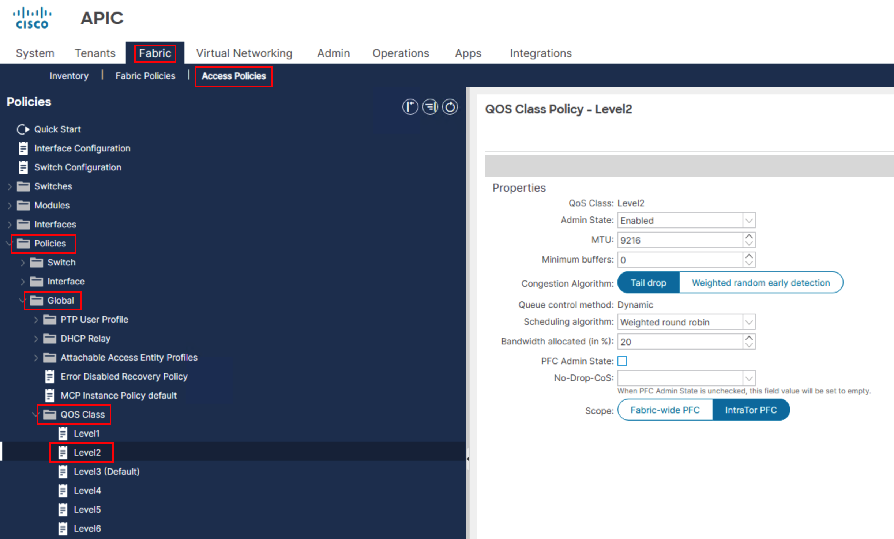

# Opening APIC GUIs and Applying Terraform Commands

## Overview

In this final step of Lab 1, you will apply your Terraform configuration to deploy RoCEv2 QoS policies to both ACI fabrics and verify the results in the APIC GUI.

## Step 1: Open APIC GUIs

- Open Chrome Browser on the Desktop of the Windows Machine
- Click on shortcuts to each APIC: **‘APIC-SF’** and **‘APIC-NY’** with separate Tabs for each
- Login to each apic via **admin/C1sco12345**


- Click ‘Let’s Go!’ in the Welcome Screen:


- Close this next Window:


- From each APIC, navigate to **Fabric -> Access Policies -> Policies -> Global -> QOS Class -> Level2**, where the default **‘Best Effort’** QoS settings will then be displayed on the right:



- (Optional) – Right Click on one of the Browser Tabs and select ‘Add tab to new split view’ to get the view of both APIC’s:


## Step 2: Execute Terraform Init

Make sure you are in the /opt/tf/terraform directory, then issue the ‘terraform init’ command to initialize and set up the working directory by downloading the required providers, modules, and plugins so the configuration is ready to run.

```bash
cd /opt/tf/terraform
terraform init
```

Inclusive within the output <span class="tf-success">Terraform has been successfully initialized!</span> should be seen.

## Step 3: Execute Terraform Plan

Under the same directory, issue a ‘terraform plan’ to shows what changes Terraform will make by comparing the configuration to the current infrastructure and producing an execution plan.

```bash
terraform plan
```

The end of the output should display **‘Plan: 12 to add, 0 to change, 0 to destroy’** i.e. 5 of the same objects from each APIC

Before the next section, move the ‘tools’ Putty session Window to a different area so that changes to the GUI can be seen when executing the ‘terraform apply’ and ‘terraform destroy’ commands:


## Step 4: Execute Terraform Apply

Under the same directory, issue a ‘terraform apply’ to executes the planned changes and update the real infrastructure to match your Terraform configuration. 

```bash
terraform apply
```

Then select ‘yes’ when asked to Enter a value.  The changes should now be seen in the GUI:

Alternatively, **‘terraform apply –auto-approve’** can be used to skip the extra prompt.

```bash
terraform apply --auto-approve
```


The end output of the terraform apply command should state:

<span class="tf-success">Apply complete! Resources: 12 added, 0 changed, 0 destroyed</span>.

If both tabs were to now be refreshed, the GUI at the top would now show that both APIC’s are now both being managed by Terraform:


Now navigate back to /opt/tf/terraform, you will notice 1 extra automatically created file:

```bash
cd /opt/tf/terraform/
```

**terraform.tfstate** is Terraform’s primary state file, automatically created on the first successful terraform apply, and it records the current, authoritative mapping between your configuration and real infrastructure.

## Step 5: Execute Terraform Destroy

Under the same directory, issue a ‘terraform destroy’ to remove all infrastructure managed by the Terraform configuration, returning the environment to a clean state. The changes should now be seen in the GUI where each APIC are back to their original state:

```bash
terraform destroy
```

Then select ‘yes’ when asked to Enter a value.  The changes should now be seen in the GUI:

Alternatively, **‘terraform destroy –auto-approve’** can be used to skip the extra prompt:

```bash
terraform destroy --auto-approve
```


The end output of the terraform apply command should state: 
<span class="tf-success">Destroy complete! Resources: 12 destroyed</span>.

You will now see another extra automatically created file:

**terraform.tfstate.backup** which is automatically created just before the state file is updated, acting as a safety copy of the previous state so you can recover if an apply or state change goes wrong.

## Lab 1 Complete!

Congratulations! You have successfully:

- ✅ Installed Terraform
- ✅ Built a root module
- ✅ Created a reusable child module
- ✅ Deployed RoCEv2 QoS to dual ACI fabrics
- ✅ Verified configuration in APIC GUI

## Next Steps

Ready to explore a different approach? Proceed to [Lab 2: Terraform NAC](../lab2-terraform-nac/introduction-to-nac.md) to learn about Network as Code with YAML-driven configuration.
