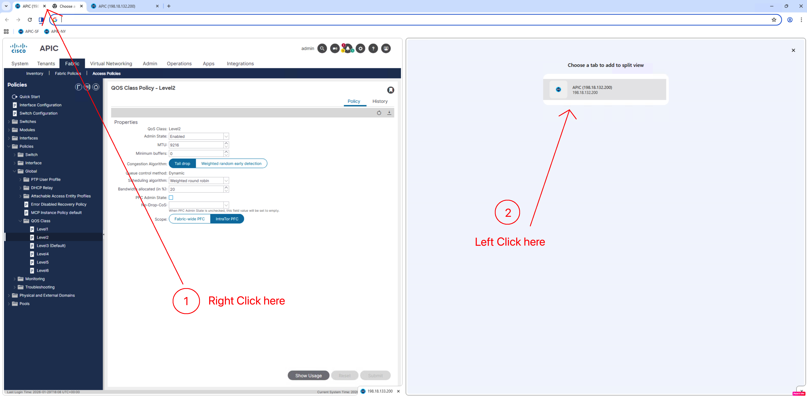
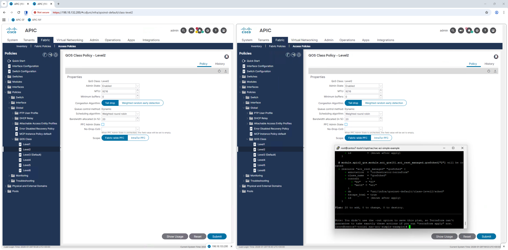
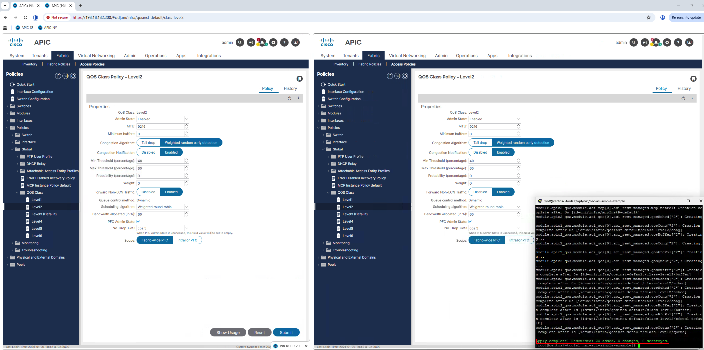
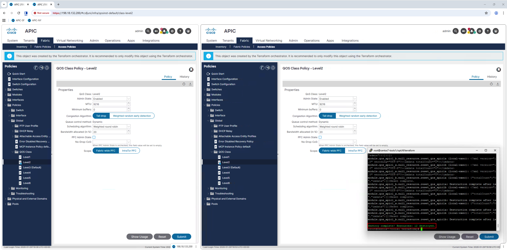

# Deploying NAC Configuration

## Overview

In this final step of Lab 2, you will deploy the NAC YAML configuration to both ACI fabrics and verify the results.

## Step 1: Open both APIC Simulators

- Open Chrome Browser on the Desktop of the Windows Machine
- Click on shortcuts to each APIC: ‘APIC-SF’ and ‘APIC-NY’ with separate Tabs for each
- Login to each APIC via admin/C1sco12345


- From each APIC, navigate to **Fabric -> Access Policies -> Policies -> Global -> QOS Class -> Level2**, where the default **‘Best Effort’** QoS settings will then be displayed on the right:


- (Optional) – Right Click on one of the Browser Tabs and select ‘Add tab to new split view’ to get the view of both APIC’s:




!!! note "Multiple Browser Tabs"
    Keep both APIC GUI tabs open. After running the Terraform commands, you can immediately see the configuration changes applied across both fabrics simultaneously.

## Step 2: Execute Terraform Init

- Navigate back to /opt/nac/nac-aci-simple-example, then issue the ‘terraform init’ command to initialize and set up the working directory by downloading the required providers, modules, and plugins so the configuration is ready to run.

```bash
cd /opt/nac/nac-aci-simple-example/
terraform init
```

Inclusive within the output <span class="tf-success">Terraform has been successfully initialized!</span> should be seen.

## Step 3: Execute Terraform Plan

- Under the same directory, issue a ‘terraform plan’ to show what changes Terraform will make by comparing the configuration to the current infrastructure and producing an execution plan.

```bash
terraform plan
```

The end of the output should display **‘Plan: 20 to add, 0 to change, 0 to destroy’** i.e. 10 of the same objects from each APIC

!!! warning "NAC slower"
    Observe that NAC is slower because it adds an abstraction layer that translates YAML intent into multiple Terraform resources, increasing processing and API calls. Classic Terraform talks directly to the provider with fewer layers, so plans and applies run faster.

!!! tip "View GUI changes in real time"
    Before the next section, move the ‘tools’ Putty session Window to a different area so that changes to the GUI can be seen when executing the ‘terraform apply’ and ‘terraform destroy’ commands:



## Step 4: Execute Terraform Apply

- Under the same directory, issue a ‘terraform apply’ to executes the planned changes and update the real infrastructure to match your Terraform configuration. 

```bash
terraform apply
```

- Then select ‘yes’ when asked to Enter a value.  The changes should now be seen in the GUI:

- Alternatively, **‘terraform apply –auto-approve’** can be used to skip the extra prompt:

```bash
terraform apply --auto-approve
```



The end output of the terraform apply command should state: 
<span class="tf-success">Apply complete! Resources: 20 added, 0 changed, 0 destroyed</span>.

If both tabs were to now be refreshed, the GUI at the top would now show that both APIC’s are now both being managed by Terraform:


You will notice 1 extra automatically created file under /opt/nac/nac-aci-simple-example/

**terraform.tfstate** is Terraform’s primary state file, automatically created on the first successful terraform apply, and it records the current, authoritative mapping between your configuration and real infrastructure.

## Step 5: Execute Terraform Destroy

- Under the same directory, issue a ‘terraform destroy’ to remove all infrastructure managed by the Terraform configuration, returning the environment to a clean state. The changes should now be seen in the GUI where each APIC are back to their original state.

```bash
terraform destroy
```

- Then select ‘yes’ when asked to Enter a value.  The changes should now be seen in the GUI:

- Alternatively, **‘terraform destroy –-auto-approve’** can be used to skip the extra prompt:

```bash
terraform destroy --auto-approve
```



The end output of the terraform apply command should state: 
<span class="tf-success">Destroy complete! Resources: 20 destroyed</span>.

You will now see another extra automatically created file:

**terraform.tfstate.backup** which is automatically created just before the state file is updated, acting as a safety copy of the previous state so you can recover if an apply or state change goes wrong.

## Lab 2 Complete!

Congratulations! You have successfully:

- ✅ Set up NAC environment
- ✅ Created YAML configuration
- ✅ Deployed via NAC to dual fabrics
- ✅ Compared NAC vs. Custom modules

### Key Takeaways

1. **NAC simplifies configuration** - YAML is more accessible than HCL
2. **Same result, different approach** - Both labs achieve identical ACI config
3. **Choose the right tool** - Custom modules for flexibility, NAC for speed

## Next Steps

Ready to try a different approach? Proceed to [Lab 3: Python Automation](../lab3-python/python-overview.md) to implement RoCEv2 QoS using Python and the ACI SDK.
