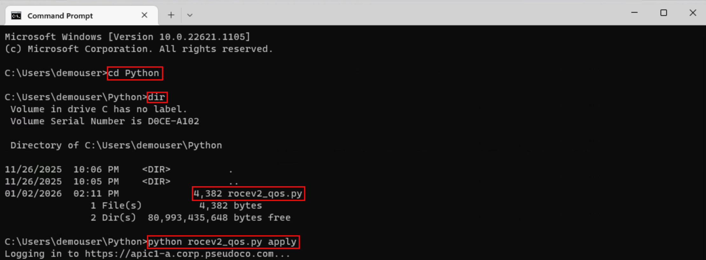

# Executing the Python Script

## Overview

In this final section, you will create and execute a Python script that deploys RoCEv2 QoS policies to both ACI fabrics using the REST API.

# Login to Both APICs

Open both APIC Simulators

- Open Chrome Browser on the Desktop of the Windows Machine
- Click on shortcuts to each APIC: ‘APIC-SF’ and ‘APIC-NY’ with separate Tabs for each
- Login to each APIC via admin/C1sco12345


- From each APIC, navigate to **Fabric -> Access Policies -> Policies -> Global -> QOS Class -> Level2**, where the default **‘Best Effort’** QoS settings will then be displayed on the right:


- (Optional) – Right Click on one of the Browser Tabs and select ‘Add tab to new split view’ to get the view of both APIC’s:


!!! note "Multiple Browser Tabs"
    Keep both APIC GUI tabs open. After running the Ansible playbook, you can refresh these pages to immediately see the configuration changes applied across both fabrics simultaneously.

## Executing the Python Script

- Open Command Prompt again from the Taskbar, change the directory to the Python Folder

- Run the Python script to apply the configuration: **python rocev2_qos.py apply**

```bash
python rocev2_qos.py apply
```



- Observe the changes in the APIC GUI:


- Run the Python script to reset the configuration: **python rocev2_qos.py destroy**

```bash
python rocev2_qos.py destroy
```

- Observe the APIC GUI reverting to its normal state:


!!! tip "Python Script"
    As an alternative viewing the Python script from the Woskstation itself, you can instead refer to **Appendix B** to also review full Python Script and its explaination.

## Lab 3 Complete!

Congratulations! You have successfully:

- ✅ Installed Python and ACI SDK
- ✅ Created authentication module
- ✅ Deployed RoCEv2 QoS via Python
- ✅ Verified configuration in APIC GUI

### Key Takeaways

1. **Python provides maximum flexibility** - Full programming capabilities
2. **REST API direct access** - Understand exactly what's happening
3. **Requires more code** - But offers more control
4. **Great for integration** - Easy to connect with other systems

## Next Steps

Ready for the next approach? Proceed to [Lab 4: Bruno API](../lab4-bruno/bruno-overview.md) to explore API automation using the Bruno GUI client.
