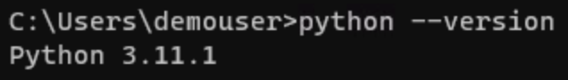
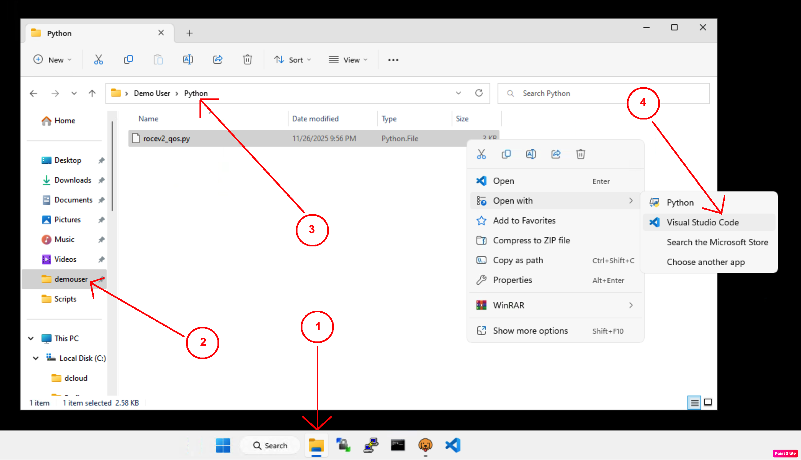
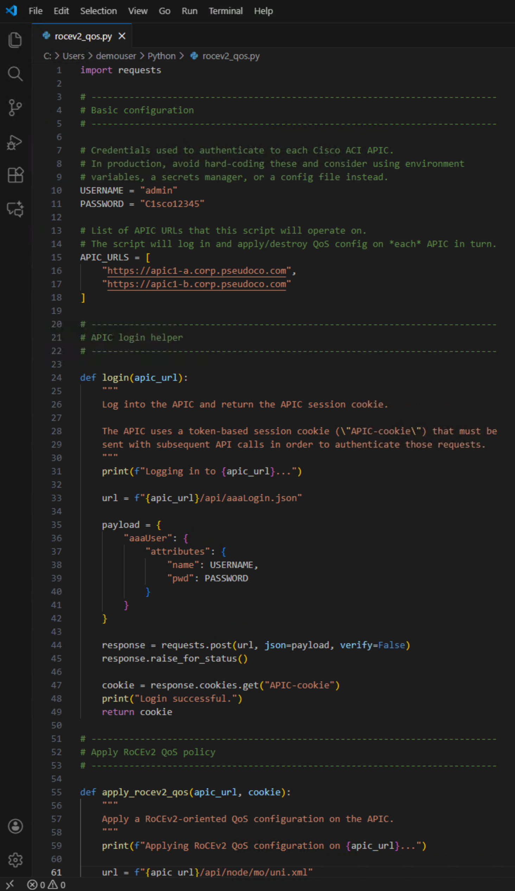

# Verify Python & Install Dependencies

## Step 1: Verify Python Installation

Check Python version:

- Verify Python version on Windows Machine: Open Command Prompt from the Task Bar and type python –version:

```bash
python --version
```



- Install the requests library (if not already installed):
pip install requests

```bash
pip install requests
```


- Locate the Python script: Open Explorer from the Taskbar, navigate to the Demouser folder, then Python folder, and open the **‘rocev2qos.py’** Python File in Visual Studio Code (or Notepad++) to view its content:



- The Python Code can now be viewed including # comments describing the script. Please refer to Appendix B to review the Python Script at greater detail:



## Next Steps

Proceed to [Execute Script](execute-script.md) to create a Python script that applies the QoS policies to both APIC controllers.
