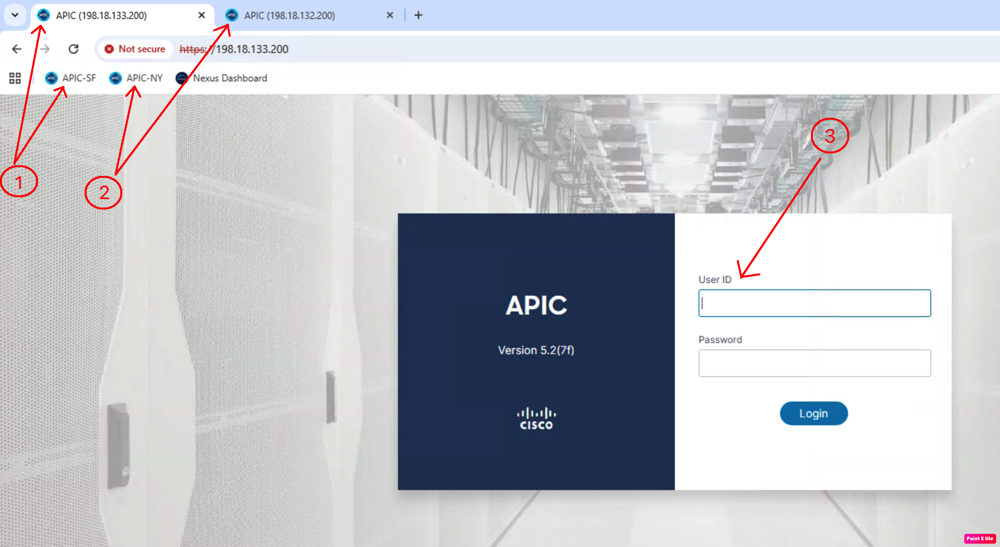
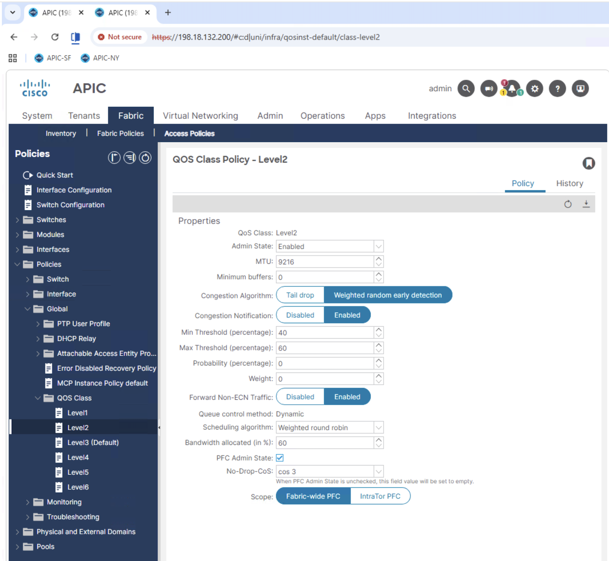
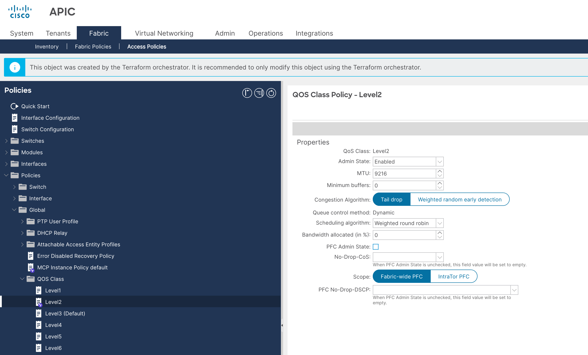
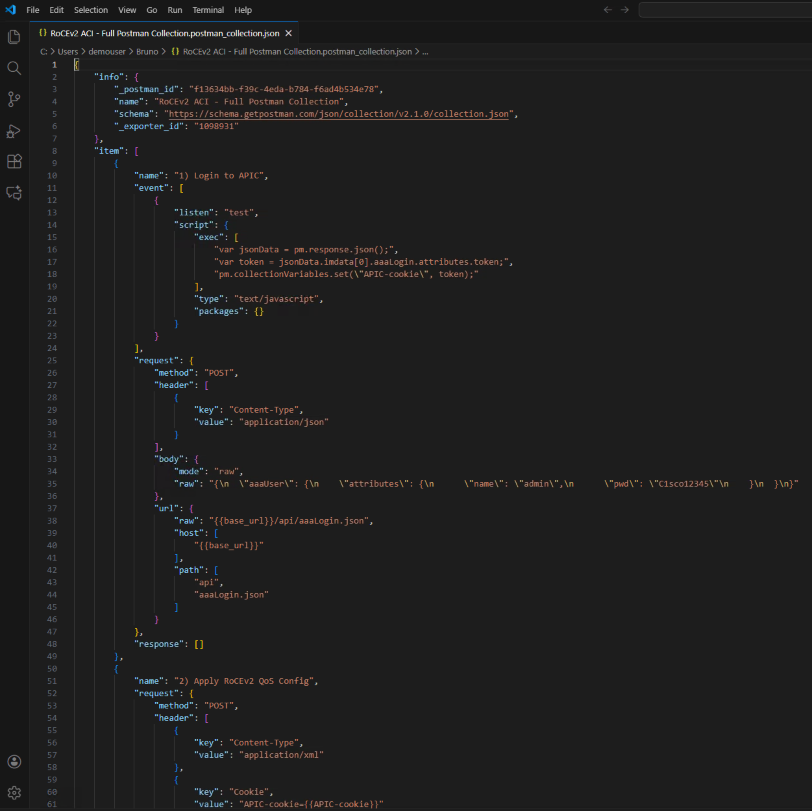

# Apply QoS Policy

## Overview

In this final step of Lab 4, you'll use Bruno to create the complete RoCEv2 QoS configuration on both ACI fabrics through REST API calls.

## Steps

Open both APIC Simulators

- Open Chrome Browser on the Desktop of the Windows Machine
- Click on shortcuts to each APIC: ‘APIC-SF’ and ‘APIC-NY’ with separate Tabs for each
- Login to each APIC via admin/C1sco12345

- From just Apic1-a, navigate to **Fabric -> Access Policies -> Policies -> Global -> QOS Class -> Level2**, where the default **‘Best Effort’** QoS settings will then be displayed on the right:

- Select the 1st POST Command
- Click on the Arrow on the right-hand side of the window to apply the POST Command. You should receive a 200 OK, indicating successful login:

- Select the 2nd POST Command: Apply the QoS Config. Have the APIC GUI in the background to verify that QoS has been applied successfully.

- Select the 3rd POST Command: Reset the QoS Config back to its original Best Effort State.

- Optional: Modify the base_url environment to point to the second APIC (e.g., https://apic1-b.corp.pseudoco.com). Click Save then Activate.

- Repeat the above steps with the POST Commands and verify successful application to the second APIC via the GUI.

- Optional: Open the RoCEv2 ACI - Full Postman Collection.postman_collection file in Visual Studio Code to view its structure:

- Notice how the script separates sections for logging in, applying QoS, and removing QoS:

!!! tip "Optional"
    Please refer to [**Appendix C**](/ACI_RoCEv2/appendices/#appendix-c-bruno-json-script-explaination) to review full .json file along with its explaination.

## Lab 4 Complete!

Congratulations! You have successfully:

- ✅ Imported Bruno collection
- ✅ Configured environments
- ✅ Authenticated to both APICsS
- ✅ Created RoCEv2 QoS via REST API
- ✅ Verified in APIC GUI

### Key Takeaways

1. **Bruno provides visual API interaction** - Great for learning and testing
2. **REST API is the foundation** - All tools eventually use the REST API
3. **Collections are reusable** - Share with team, version control
4. **Environments enable flexibility** - Easy testing across multiple fabrics

## Next Steps

Proceed to [Lab 5: Ansible Playbooks](../lab5-ansible/ansible-overview.md) for the final lab!
