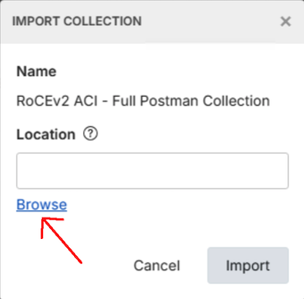
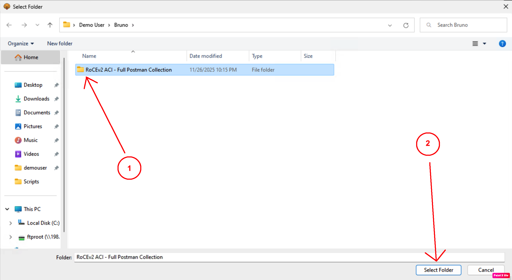

# Import Collection

## Step 1: Launch Bruno

- Open Bruno from the Desktop or Taskbar of the Windows machine
- Select Import Collection.

## Step 2: Locate the Collection

- Select the **RoCEv2 ACI - Full Postman Collection.postman_collection** file:

- Select the **RoCEv2 ACI - Full Postman Collection** folder that appears:

- Click Import

- The Collection is on the left-hand side of the screen. Click it, and a pop-up will appear. Choose Safe Mode:

## Next Steps

Proceed to [Configure Environment](configure-environment.md) to set up the APIC connection details.
