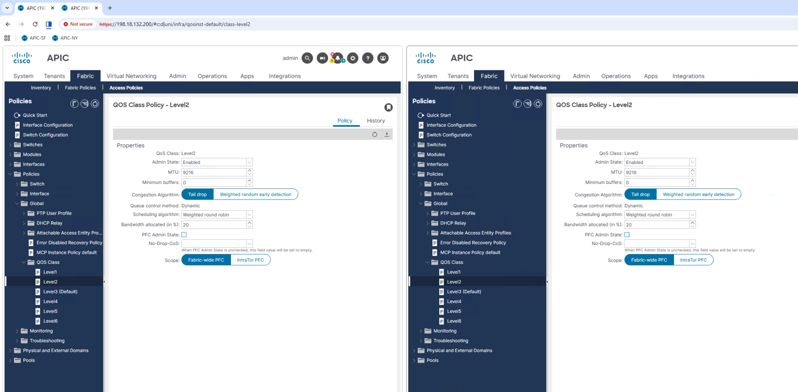
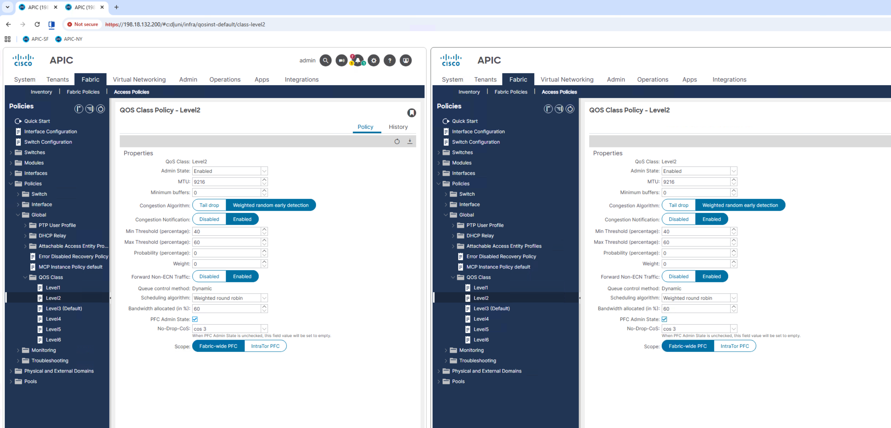

# Running Ansible Playbooks

Open both APIC Simulators

- Open Chrome Browser on the Desktop of the Windows Machine
- Click on shortcuts to each APIC: ‘APIC-SF’ and ‘APIC-NY’ with separate Tabs for each
- Login to each APIC via admin/C1sco12345


- From each APIC, navigate to **Fabric -> Access Policies -> Policies -> Global -> QOS Class -> Level2**, where the default **‘Best Effort’** QoS settings will then be displayed on the right:


- (Optional) – Right Click on one of the Browser Tabs and select ‘Add tab to new split view’ to get the view of both APIC’s:





## Navigate to Ansible Directory

- Navigate back to the ansible directory in the Putty session:

```bash
cd /opt/ansible/
```

## Run the Apply QoS Playbook

- Run the playbook to apply the QoS configuration:

```bash
ansible-playbook -i inventory.ini playbooks/rocev2_qos.yml
```

### Expected Output

- You should see output showing tasks as `ok` for both APICs:

<pre style="font-size: 66%;">
PLAY RECAP *******************************************************************************
<span class="tf-success">apic1-a.corp.pseudoco.com</span>  : <span class="tf-success">ok=3</span>    changed=0    unreachable=0    failed=0    skipped=0    rescued=0    ignored=0
<span class="tf-success">apic1-b.corp.pseudoco.com</span>  : <span class="tf-success">ok=3</span>    changed=0    unreachable=0    failed=0    skipped=0    rescued=0    ignored=0
</pre>

- Also observe changes in the APIC GUI:




!!! success "Playbook Completed"
    All tasks completed successfully on both APIC controllers. The QoS configuration for RoCEv2 has been applied.

## Run the Reset QoS Playbook

- Run the playbook to reset the QoS configuration back to defaults:

```bash
ansible-playbook -i inventory.ini playbooks/reset_qos.yml
```

### Expected Output

- You should see output showing tasks as `ok` for both APICs:

<pre style="font-size: 66%;">
PLAY RECAP *******************************************************************************
<span class="tf-success">apic1-a.corp.pseudoco.com</span>  : <span class="tf-success">ok=3</span>    changed=0    unreachable=0    failed=0    skipped=0    rescued=0    ignored=0
<span class="tf-success">apic1-b.corp.pseudoco.com</span>  : <span class="tf-success">ok=3</span>    changed=0    unreachable=0    failed=0    skipped=0    rescued=0    ignored=0
</pre>

- Also observe changes in the APIC GUI:


!!! success "Playbook Completed"
    All tasks completed successfully on both APIC controllers. The QoS configuration has been reset to default values.

## Key Observations

### Parallel Execution
Notice that Ansible executed tasks on both APIC controllers **simultaneously**. This is one of Ansible's key strengths - parallel execution across multiple hosts.

### Idempotency
If you run the same playbook multiple times, Ansible will report the same result. The playbooks are idempotent - they can be safely run multiple times without causing unintended changes.

### Speed
The entire configuration change across both fabrics completed in seconds. This demonstrates the power of automation compared to manual GUI configuration.

## Next Steps

Congratulations! You've successfully:

- Created Ansible inventory and variable files
- Written playbooks to configure and reset QoS settings
- Executed playbooks across multiple APIC controllers simultaneously
- Verified configuration changes through the APIC GUI

This lab demonstrated Ansible's procedural approach to automation, complementing the declarative approaches shown in the Terraform labs. Each tool has its strengths and appropriate use cases in a comprehensive automation strategy.

You've completed all labs! Proceed to the [Conclusion](../../Conclusion.md) for a workshop summary and next steps.


